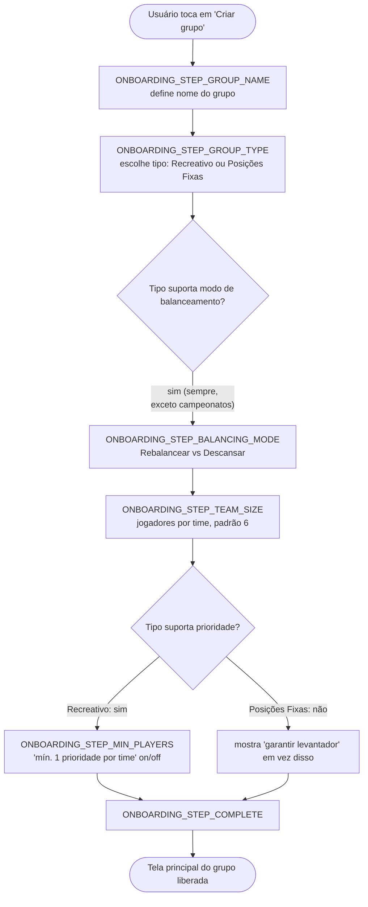
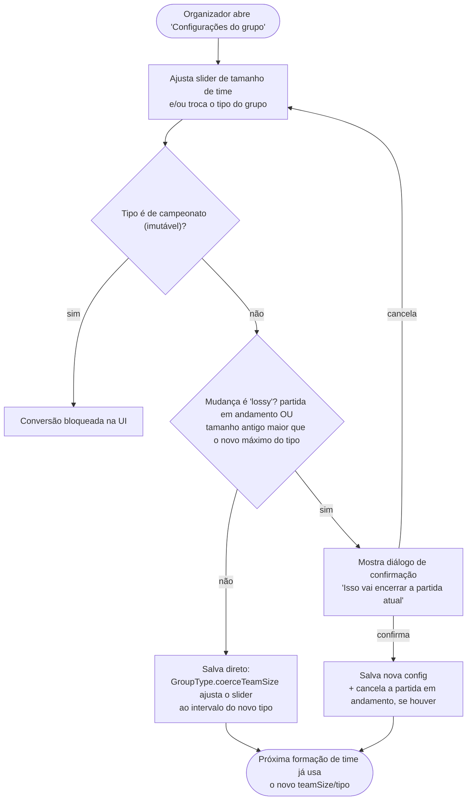
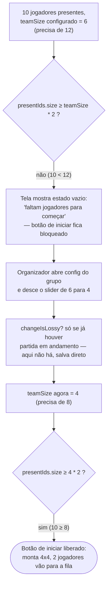
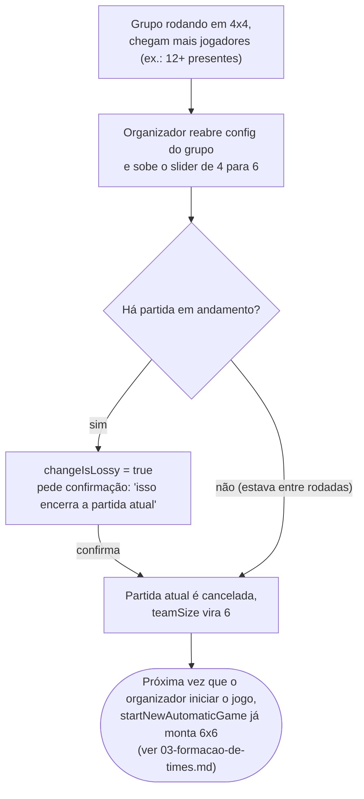

# 01 — Ciclo de vida do grupo

## 1.1 Criação de um grupo (onboarding)

Ao criar um grupo (`CreateGroupDialog` → `onboardingStep`), o app pede as informações em
etapas sequenciais antes de liberar a tela principal do jogo.

> Nos tipos de campeonato (fora de escopo/implementação, ver [índice](./00-indice-dos-fluxogramas.md)) este fluxo seria mais
> curto: sem etapa de modo de balanceamento nem de prioridade.

## 1.2 Conversão de tipo de grupo e mudança de tamanho de time

Depois de criado, o organizador pode reabrir `GroupConfigDialog` a qualquer momento (inclusive
com uma partida em andamento) para trocar o tipo do grupo e/ou o número de jogadores por time
usando um slider. **O app nunca faz essa troca sozinho** — é sempre uma ação manual aqui.

### Caso de uso: "6x6 virou 4x4 porque só vieram 10 pessoas"

Isso é só a aplicação do fluxo acima com `teamSize: 6 → 4`:

### Caminho de volta: chegou mais gente, quer voltar a 6x6

