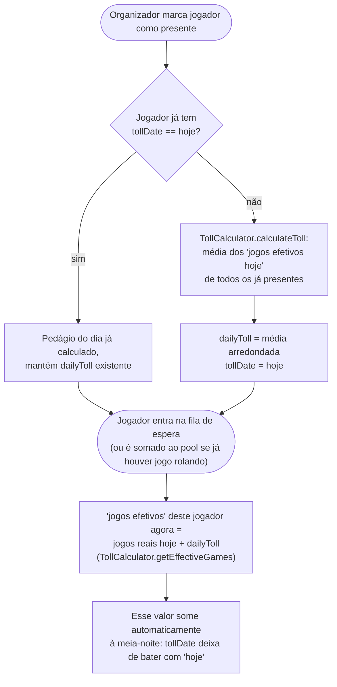
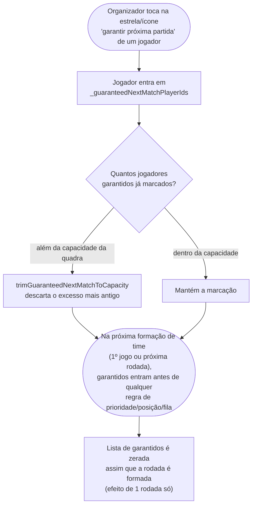
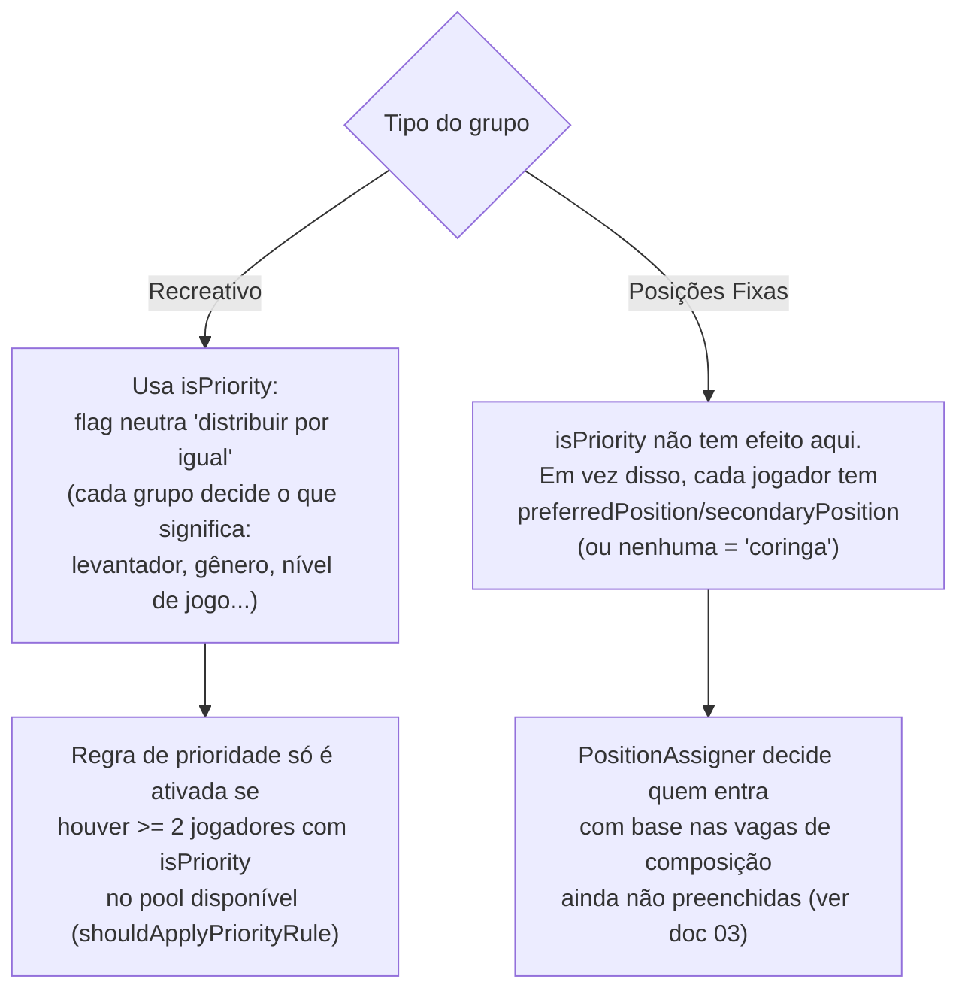

# 02 — Check-in e fila de espera

## 2.1 Marcar presença e calcular o pedágio por atraso

Quando o organizador marca um jogador como presente (`togglePlayerPresence`), o app decide se
ele entra "de graça" (primeiro do dia) ou paga pedágio (chegou depois que o dia já começou).

> O pedágio existe para não punir quem chega cedo: um jogador atrasado recebe de presente a
> *média* de jogos já disputados pelo pessoal presente, em vez de entrar com 0 jogos (o que o
> colocaria sempre na frente da fila).

## 2.2 "Garantir próxima partida"

O organizador pode marcar um ou mais jogadores (presentes, mas de fora da quadra) para entrar
com prioridade total na montagem da próxima rodada — útil para quem está de saída e quer
garantir mais uma partida.

## 2.3 Quem tem prioridade na fila (contexto para a formação de times)

Antes de montar os times (ver [`03-formacao-de-times.md`](./03-formacao-de-times.md)), vale
entender que **a regra que decide quem entra primeiro muda conforme o tipo de grupo**:

