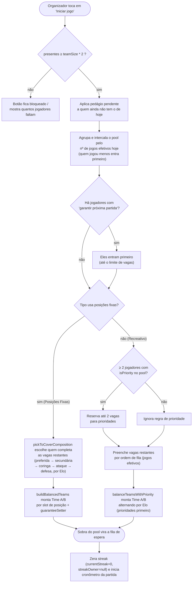
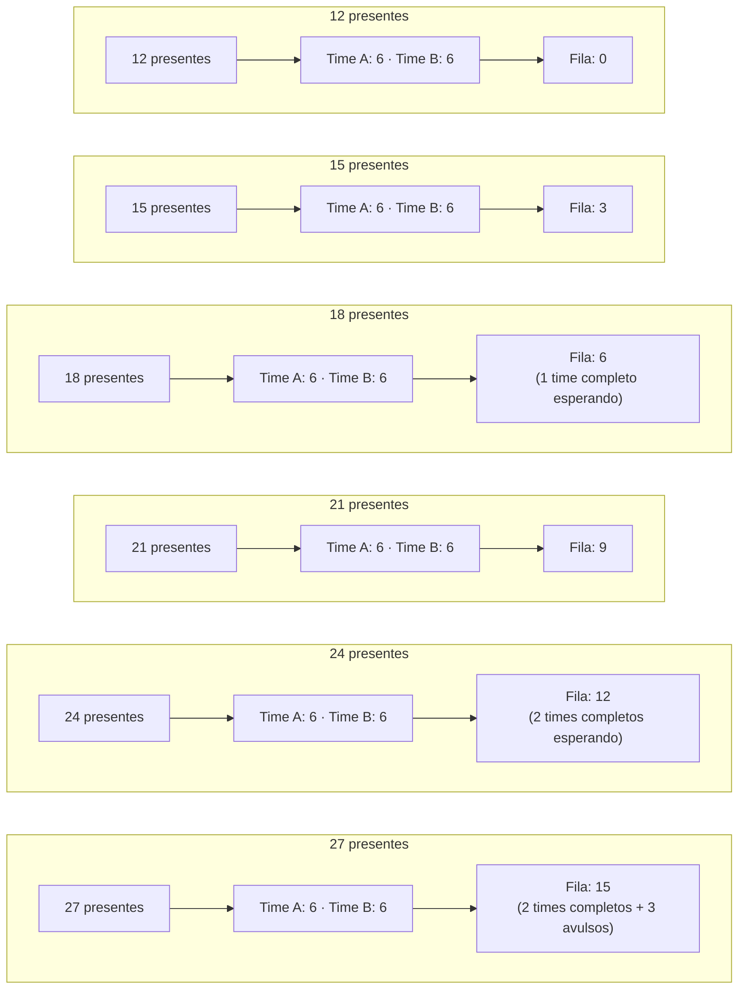
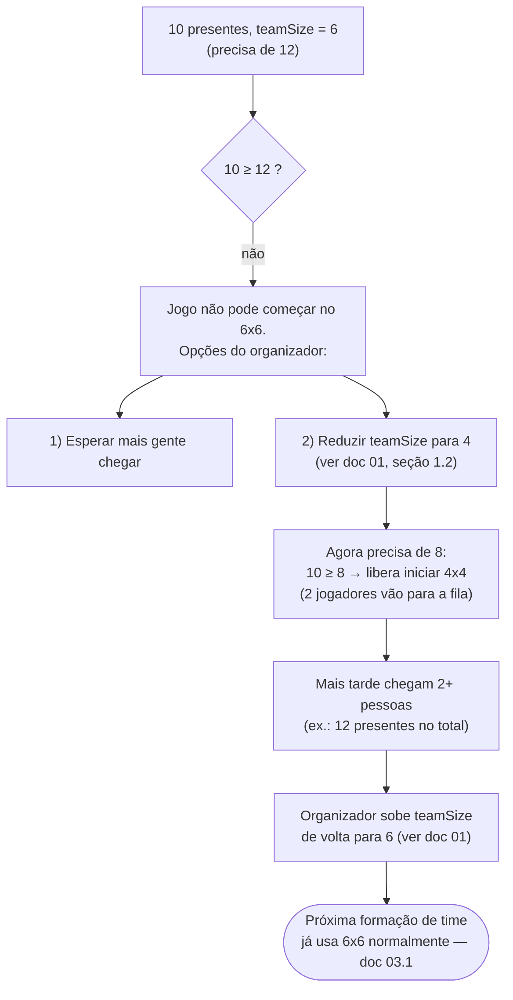

# 03 — Formação automática de times (primeiro jogo)

## 3.1 Fluxo de `startNewAutomaticGame`

Esse é o botão "Iniciar jogo" quando ainda não há partida em quadra. Ele só funciona se houver
jogadores presentes suficientes para fechar os dois times no `teamSize` configurado — **o app
nunca reduz o `teamSize` sozinho** (isso é sempre manual, ver
[`01-ciclo-de-vida-do-grupo.md`](./01-ciclo-de-vida-do-grupo.md#12-conversão-de-tipo-de-grupo-e-mudança-de-tamanho-de-time)).

## 3.2 Cenários com o padrão de 6 jogadores por time (12 em quadra)

Com `teamSize = 6` (padrão), são necessários 12 jogadores para fechar os dois times. O que
sobra vai para a fila de espera. Os diagramas abaixo comparam o resultado conforme o total de
jogadores presentes no dia:

> A quantidade de "times completos esperando" (fila dividida por `teamSize`) importa de verdade
> no **modo Descanso**: com 2+ times completos na fila, o time vencedor que bateu o limite de
> vitórias vai descansar e dois times novos entram direto da fila (ver
> [`04-fim-de-partida-e-proxima-rodada.md`](./04-fim-de-partida-e-proxima-rodada.md)). No modo
> Rebalanceamento essa contagem não muda o comportamento — a fila é sempre redistribuída.

Em **Posições Fixas**, a mesma matemática de "quantos sobram" vale, mas quem exatamente sobra
(e não só quantos) depende de quais vagas de composição (levantador, ponteiro, oposto, central,
líbero) ainda precisam ser cobertas — ver `TeamComposition.requiredSlots` para o time de 6.

## 3.3 Cenário com déficit de jogadores (menos de 12 presentes)

