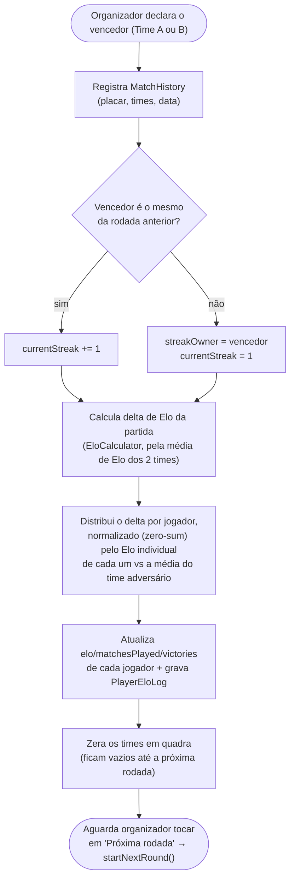
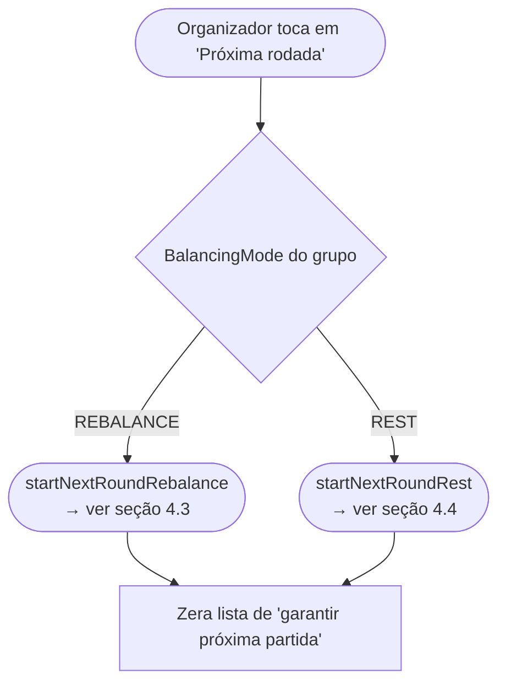
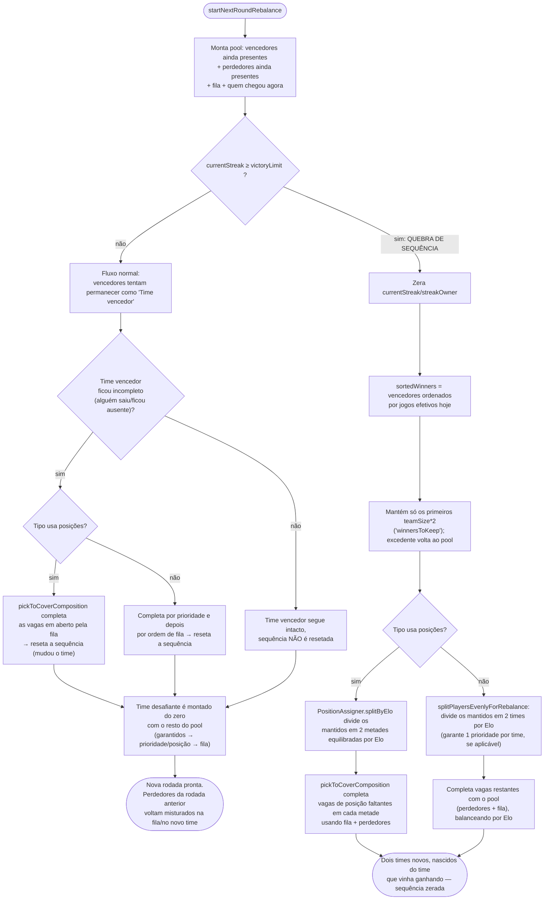
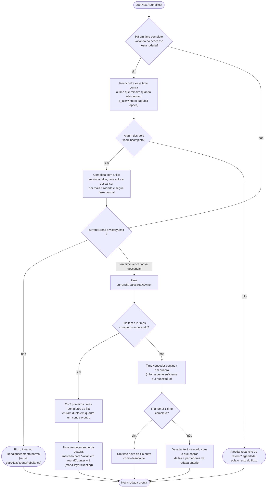
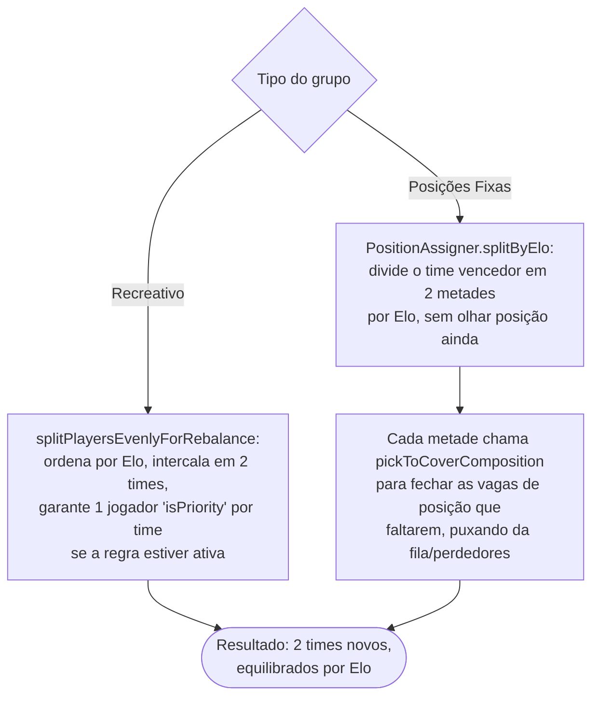

# 04 — Fim de partida, próxima rodada e os dois modos de balanceamento

## 4.1 Encerrar uma partida (`finishGame`)

## 4.2 `startNextRound`: Rebalancear vs Descansar

A escolha de modo é feita uma vez, na config do grupo (`balancingMode`), e vale para todas as
rodadas dali em diante:

## 4.3 Modo **Rebalanceamento** (`REBALANCE`)

Neste modo não existe "time dono da quadra": a cada rodada os times são remontados somando
quem ganhou + quem perdeu + fila, balanceando por Elo — **exceto** quando a sequência de
vitórias bate o limite (`victoryLimit`), que dispara uma quebra especial.

## 4.4 Modo **Descanso** (`REST`) — "rei da quadra"

Aqui o time vencedor permanece em quadra partida após partida (só trocando o adversário pela
fila) até bater o limite de vitórias — só então ele vai descansar de verdade.

### Diferença Recreativo vs Posições Fixas na quebra de sequência (ambos os modos)

## 4.5 Nota: tipos de campeonato

`TOURNAMENT_RECREATIONAL` e `TOURNAMENT_PRO` não têm `balancingMode` (`supportsBalancingMode
= false`) — não existe "próxima rodada" automática como nos fluxos acima. Esses tipos ainda
não têm essa parte da engine implementada (ver nota no [`00-indice-dos-fluxogramas.md`](./00-indice-dos-fluxogramas.md)).
