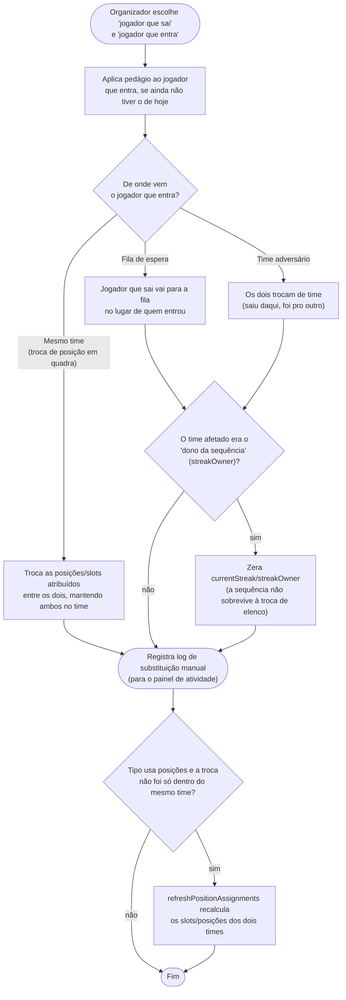
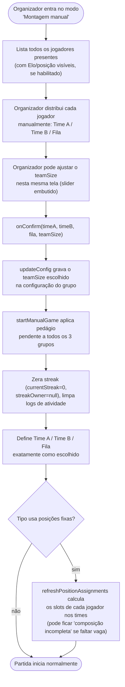

# 05 — Substituição manual e montagem manual de times

## 5.1 Substituir um jogador (`substitutePlayer`)

Durante uma partida em andamento, o organizador pode trocar qualquer jogador da quadra por
outro (do banco/fila ou do time adversário) a qualquer momento.

## 5.2 Montagem manual de times (`ManualSetupScreen` / `startManualGame`)

Em vez de deixar o app montar os times automaticamente, o organizador pode arrastar/selecionar
jogadores manualmente para o Time A, Time B e a fila — por exemplo para respeitar combinações
específicas que o algoritmo automático não captura.

> Diferente da formação automática (doc `03`), aqui **não há bloqueio por quantidade mínima de
> jogadores** nem regra automática de prioridade/posição — a responsabilidade de montar times
> válidos é inteiramente do organizador.
